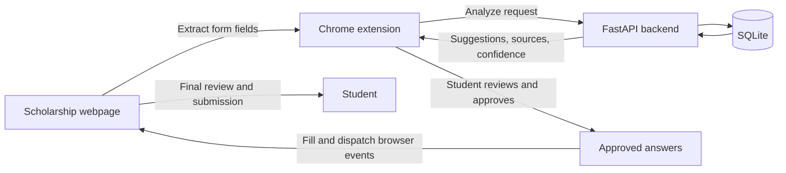

# ScholarSafe

ScholarSafe is a human-in-the-loop scholarship application assistant. It
maintains a student profile and a bank of verified experiences, analyzes
ordinary scholarship forms, proposes traceable answers, and fills only the
answers the student explicitly approves.

The core promise is simple:

> Prepare the application, then require human review and submission.

ScholarSafe does not submit applications, click final confirmation controls,
solve CAPTCHAs, upload documents, or invent personal experiences.

## Current status

This repository contains a functional MVP with:

- A responsive student dashboard
- A FastAPI backend with SQLite persistence
- Deterministic field classification and confidence scoring
- Evidence-based, template-driven essay drafting
- A Manifest V3 Chrome extension with an application review side panel
- A representative scholarship application for safe end-to-end testing
- Automated tests proving that only approved fields are filled

The private dashboard is deployed at
[scholarsafe.andrei4jon.chatgpt.site](https://scholarsafe.andrei4jon.chatgpt.site).
The FastAPI service and unpacked Chrome extension currently run locally; the
deployed dashboard is not yet a hosted end-to-end production service.

## How the pieces fit together



### Dashboard

The React dashboard in `app/` lets a student:

- Review suggested application answers
- Edit and verify profile information
- Inspect the experience bank
- See sources, confidence levels, and missing information
- Track application progress

The dashboard demonstrates the intended product workflow. Profile saves call
the local FastAPI service when it is available.

### FastAPI backend

The backend in `backend/` is the decision and persistence layer. It:

1. Validates requests with Pydantic models.
2. Authenticates a personal bearer token and resolves its owning user.
3. Loads only that user's profile fields and verified experiences.
4. Classifies every extracted form field.
5. Selects a profile answer or creates a reviewable draft.
6. Calculates confidence and records the source.
7. Persists user-owned applications, fields, drafts, and approvals.
8. Returns every suggestion with `approved: false`.

The backend has no application-submission endpoint.

### Chrome extension

The extension in `extension/` contains three main parts:

- `field_extractor.js` detects visible controls, labels, options, required
  status, character limits, and stable selectors.
- `sidepanel/` sends the extracted form to FastAPI and presents every answer for
  editing, rejection, or approval.
- `settings.js` and `options/` let the student connect to a local or hosted
  FastAPI address. Chrome asks for access before a new server is used.
- `session_store.js` restores active reviews, tracks multiple pages from the
  same application site, expires saved pointers after seven days, and provides
  a device-level clear action.
- `field_filler.js` writes only approved values and dispatches bubbling
  `input`, `change`, and `blur` events so modern forms recognize the changes.

The filler explicitly refuses submit buttons, file inputs, hidden inputs,
password fields, and unsupported controls.

## End-to-end application flow

1. The student opens an ordinary scholarship form.
2. The extension side panel is opened.
3. **Analyze application** extracts the form structure.
4. FastAPI classifies each field and returns an answer recommendation.
5. The side panel displays the answer, source, confidence, and facts used.
6. The student edits, rejects, or approves each eligible answer.
7. **Fill approved fields** fills only the approved subset.
8. The student reviews the original scholarship page.
9. The student handles manual fields and submits the application personally.

Closing the loop is intentional: preparation is automated, but responsibility
for correctness and submission remains with the student.

## Field classification

The classifier uses deterministic rules before any future model-based fallback.

| Action | Meaning | Example |
| --- | --- | --- |
| `profile_autofill` | Match a known profile path | First name, major, university |
| `draft_for_review` | Draft from verified experiences | Technical challenge essay |
| `ask_user` | Information is missing or uncertain | Volunteer hours |
| `sensitive` | Do not store or suggest | Household income, SSN |
| `manual_only` | Must be completed directly | Signature, transcript, final certification |
| `ignore` | Not an answer field | Submit button, hidden control |

Rules for sensitive and manual controls run before profile or essay matching.
That ordering prevents a word such as “name” inside an electronic-signature
label from being mistaken for a normal profile field.

## Confidence scoring

Profile confidence considers:

- Exact versus keyword-only label matching
- Whether the source field is verified
- Whether the match is ambiguous
- Whether the value is missing

Generated-answer confidence considers:

- Number of verified facts available
- Relevance of the selected experience
- Whether the field supplies a length constraint

The intended interpretation is:

- `0.90–1.00`: strong profile match, still reviewable
- `0.70–0.89`: highlight for review
- Below `0.70`: request information
- Sensitive, signature, upload, and submission controls: always manual or
  ignored regardless of score

Generated drafts are capped below `0.90`, so they never appear equivalent to a
verified exact profile match.

## Essay drafting and fact traceability

The current essay generator is deterministic rather than LLM-powered. It:

1. Discards every unverified experience.
2. Compares the prompt with experience titles, themes, and situations.
3. Selects the most relevant verified experience.
4. Builds a draft from its situation, actions, and results.
5. Returns the exact experience and facts used.
6. Returns `MISSING_INFORMATION` when evidence is insufficient.

This produces less polished prose than a language model, but it establishes the
important safety contract first: every narrative statement must be traceable to
student-approved evidence.

## Stored data

The local SQLite database contains:

- `users`
- `profiles`
- `profile_fields`
- `experiences`
- `scholarships`
- `applications`
- `application_fields`
- `generated_answers`
- `documents`

Profile values and experience lists are stored as JSON where appropriate.
Every profile field records its verification status, source, and update time.
Generated-answer records retain the facts and experiences used.

The database defaults to `backend/scholarsafe.db`. Set
`SCHOLARSAFE_DATABASE` to use another location.

## Safety contract

1. Only verified profile facts are treated as high-confidence answers.
2. Only verified experiences are eligible for essay drafting.
3. Every generated answer requires review.
4. Editing an approved answer removes its approval.
5. Sensitive, upload, signature, CAPTCHA, certification, and submission
   controls cannot be approved for filling.
6. The side panel filters unsafe fields before sending a fill request.
7. The page-level filler independently refuses dangerous control types.
8. ScholarSafe never activates the application submit button.

The side-panel and page-level checks intentionally overlap. A failure in one
layer should not silently turn a manual control into an automated action.

## Project structure

```text
Scholarship-Assistant/
├── app/                 # React dashboard
├── backend/
│   ├── api/             # Profile, application, and drafting routes
│   ├── database/        # SQLite connection, schema, and seed data
│   ├── models/          # Pydantic request and response models
│   ├── services/        # Classification, confidence, and drafting rules
│   └── tests/
├── db/                  # Hosted D1/Drizzle schema
├── drizzle/             # Generated D1 migrations
├── extension/
│   ├── options/         # Configurable FastAPI connection
│   └── sidepanel/       # Chrome review interface
├── public/
│   └── demo-application.html
├── scripts/
│   └── prove-extension-flow.mjs
└── tests/               # Dashboard and extension DOM tests
```

## Local setup

### Prerequisites

- Node.js 22 or newer
- Python 3.11 or newer, including Python 3.14
- Google Chrome or another Chromium browser that supports Manifest V3 side
  panels

### 1. Install dashboard dependencies

```bash
npm install
```

### 2. Create the Python environment

```bash
python3 -m venv .venv
source .venv/bin/activate
pip install -r backend/requirements.txt
```

### 3. Start FastAPI

```bash
source .venv/bin/activate
uvicorn backend.main:app --reload
```

FastAPI runs at `http://localhost:8000`. Interactive API documentation is
available at `http://localhost:8000/docs`.

Local development uses the token `dev-scholar-token`. The dashboard uses it
automatically for a localhost API. Enter the same token in the extension's
settings screen. Every `/api` route requires `Authorization: Bearer <token>`;
`/health` remains public for service checks.

On first launch, the backend creates the SQLite database and inserts a sample
profile and two verified experiences. Replace the sample data before using the
project with a real application.

### Production API configuration

The included `Dockerfile` runs FastAPI as a non-root user, stores SQLite under
`/data`, and requires production authentication configuration. A deployment
must provide a persistent volume and these environment values:

```bash
SCHOLARSAFE_ENV=production
SCHOLARSAFE_DATABASE=/data/scholarsafe.db
SCHOLARSAFE_API_TOKENS={"replace-with-a-long-random-token":"student@example.edu"}
SCHOLARSAFE_ALLOWED_ORIGINS=https://your-dashboard.example
```

Generate opaque tokens with a cryptographically secure secret generator and
provide them through the hosting platform's secret manager. Never commit a
production token or expose one through `NEXT_PUBLIC_API_TOKEN`; that dashboard
variable is for local development only. SQLite deployment requires one service
instance and durable backups. A multi-instance deployment should first migrate
the backend to a managed transactional database.

### 4. Start the dashboard

In another terminal:

```bash
npm run dev
```

Open the exact local URL printed by the development server. It is usually
`http://localhost:3000`, but another port may be selected if that port is busy.

## Load the Chrome extension

1. Open `chrome://extensions`.
2. Turn on **Developer mode**.
3. Select **Load unpacked**.
4. Choose this repository's `extension/` directory.
5. Confirm that the local FastAPI service is running.
6. Open a normal HTTP or HTTPS scholarship form.
7. Select the ScholarSafe toolbar icon.
8. Choose **Analyze application**.

The extension starts with `http://localhost:8000` and the development token. To
use another FastAPI deployment, select the gear in the side-panel header, enter
its service address and your issued personal token, then approve Chrome's
one-time access request for that server.

Each scholarship tab has its own temporary review session. For browser-restart
recovery, the progress record stores only an expiring application ID, origin,
path, and timestamp—never field answers, query strings, fragments, or
manual/sensitive values. The personal API token is stored separately in the
extension's Chrome profile. FastAPI remains the authoritative source for answers
and approvals.
Pages on the same application site are tracked together for seven days. Use
**Clear saved progress on this site** to remove all of that site's device-local
pointers and temporary tab sessions.

Chrome does not run content scripts on protected pages such as
`chrome://extensions`, the Chrome Web Store, or some browser-owned new-tab
pages.

## Safe test application

Open:

```text
http://localhost:3000/demo-application.html
```

Use the actual port printed by `npm run dev` if it is not `3000`.

The fixture includes:

- Personal and education profile fields
- A native select menu
- A radio group
- A constrained essay textarea
- Missing volunteer-hour information
- Sensitive household income
- Transcript upload
- Electronic signature
- Final review confirmation
- A disabled submit button

The form never sends a network request. After reviewing the filled values, a
person may check its final confirmation and submit the fixture manually.

## Automated proof

Run:

```bash
npm run prove:flow
```

This test:

1. Starts an isolated FastAPI instance and temporary database.
2. Loads the representative application into a browser-like DOM.
3. Runs the real extension field extractor.
4. Sends the extracted fields through the real analysis endpoint.
5. Simulates explicit review decisions and persists approvals.
6. Runs the real approved-only field filler.
7. Verifies the expected values.
8. Confirms that sensitive, missing, signature, upload, and final-certification
   fields remain untouched.
9. Confirms that no submit event occurred.

The current proof extracts 15 fields, approves and fills 9, leaves 5 manual or
missing, ignores the submit control, and reports `submission_triggered: false`.

### Real-site compatibility fixture

The extractor also has a regression fixture derived from a read-only inspection
of the public 2026 Calvin L. Carrithers Aviation Scholarship application. It
covers patterns found on that live page without copying or submitting applicant
data:

- Application fields revealed only after an eligibility or terms step
- Multiple unrelated forms on the same page
- Duplicate element IDs across application and account forms
- Cross-form label collisions
- Required and optional document uploads

ScholarSafe selects the likely application form, ignores hidden and unrelated
controls, scopes selectors to that form, and keeps uploads and submission manual.

## Tests

Run the complete JavaScript and site suite:

```bash
npm test
```

Run backend tests:

```bash
source .venv/bin/activate
python -m pytest backend/tests
```

Run lint:

```bash
npm run lint
```

Check extension syntax directly:

```bash
node --check extension/field_extractor.js
node --check extension/field_filler.js
node --check extension/sidepanel/sidepanel.js
node --check extension/options/options.js
```

## API overview

All `/api` routes below require a personal bearer token and enforce record
ownership server-side.

| Method | Route | Purpose |
| --- | --- | --- |
| `GET` | `/health` | Service status and submission-disabled signal |
| `GET` | `/api/profile` | Read profile fields |
| `PUT` | `/api/profile` | Save profile fields and verification metadata |
| `GET` | `/api/experiences` | List experiences |
| `POST` | `/api/experiences` | Add an experience |
| `PUT` | `/api/experiences/{id}` | Update or explicitly verify an experience |
| `POST` | `/api/draft` | Draft from verified experiences |
| `POST` | `/api/applications/analyze` | Classify extracted fields and create suggestions |
| `GET` | `/api/applications/{id}` | Restore a saved application review |
| `PATCH` | `/api/applications/{id}/fields/{field_id}/approval` | Persist an approval or rejection |
| `GET` | `/api/applications` | List tracked applications |

## Current limitations

- FastAPI still runs locally; production hosting and managed database backups
  are not configured.
- Authentication uses administrator-issued opaque tokens from environment
  configuration. Self-service sign-in, revocation UI, expiry, and rotation are
  not implemented yet.
- The deployed dashboard and local SQLite backend are separate persistence
  environments.
- Restart recovery requires FastAPI to remain reachable because persistent
  Chrome storage intentionally contains no answers.
- Multi-page progress is grouped by site origin; portals hosting several
  simultaneous applications on one origin need stronger application identity.
- Custom React controls and single-page application route transitions need
  further work.
- The essay generator is deterministic and does not yet use an LLM.
- The extension is unpacked and has not been packaged for Chrome Web Store
  distribution.
- A live scholarship form has been inspected read-only and converted into a
  regression fixture; an end-to-end pass in a student's Chrome session still
  requires that student to review the fields and provide any application data.

## Recommended next milestones

1. Load the updated unpacked extension in Chrome and repeat the approved-only
   workflow with a consenting student on the inspected scholarship form.
2. Deploy the authenticated FastAPI service with a production database,
   backups, TLS, and secret-managed token configuration.
3. Add token expiry, rotation, and a self-service identity provider.
4. Replace the hosted dashboard's local-only API dependency with a server-side authenticated
   production API.
5. Add an evidence-constrained LLM drafting adapter with structured output.
6. Harden custom-control support and package the extension.

Do not add automatic submission as a milestone. The final review and submit
steps are intentionally outside ScholarSafe's authority.
